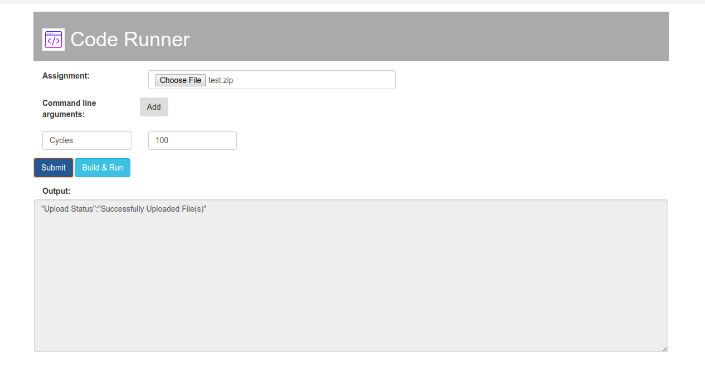

Code Runner: A tool to help run your assignments
===================================================
Code Runner is a web application to run code pertaining to your assignment using user provided configurations.

## Features
- Students can submit their assignments and view the output through a web page.
- Below is the list of details that can be provided by students.
  - Assignment tarball - Web page accepts assignment files in compressed format. Allowed formats are .zip, .tar and .tar.gz.
  - Assignment working directory - Path within the assignment directory where the commands should be run. The path should be relative to the assignment root directory.
  - Commands to compile and run.
  - Command line arguments - These are optional, provide only if required to run the assignment.
      
Currently the application supports following server features:  
- Accept assignment tarball, working directory, commands to compile and run, and command line arguments.
- Extract the files, compile and run the assignment and send the respective outputs to web page.

#### Unsupported Features
The list of unsupported features is given below.
- Does not support running assignments that read in input via standard input (stdin).
- Does not support downloading of output files.

## Build and Run Server on local machine
Compile the source code using the `make` tool as shown below.
```commandline
make
```
Use the `-h` option to get information about other command-line options.

#### Port number
Use the `-port` option to specify the port number for the server to listen requests on. Below is an example.
```commandline
./code-runner-server -port <port>
```

## Run Code Runner inside a Docker Container
- Prerequisite for this is that docker engine should be installed.
- See [instructions](https://docs.docker.com/engine/installation/) for installing docker engine on different supported platforms.
- A docker image of code runner is used as a base image for different assignment environment images.
- Code Runner base image is not directly used, instead the image pertaining to the required assignment environment should be used to run the assignments.

Use the following docker command to run the required assignment environment image.
```commandline
docker run --publish <port_to_expose>:<port_to_run> <image_tag> -port <port_to_run>
```

## Supported Languages
Below is the list of supported languages and the corresponding versions.
- gcc 7
- g++ 7
- python 3.7
- java 8 & 11

## Web page to Submit Assignment
Use the exposed port number to open the web page. Example - for exposed port number as 52453, hit [http://localhost:52453](https://htmlpreview.github.io/?https://github.com/assignment-exec/code-runner/blob/master/client/index.html) on browser.



Submit your assignment through the web page as shown in the figure above.
- Initially `Build` and `Run` buttons are disabled. Submit the assignment to enable them.
- Choose the assignment tar ball.
- Enter commands to compile and run the code.
- Enter working directory to run the commands. If not provided then commands will be run at the assignment root directory.
- Add command line arguments if required to run the assignment using `Add` button.
- Click on `Submit` button to upload the details to the server. The status of upload will be displayed in the `Output` section.
- Click on `Build` button to compile the code. The status of build will be displayed in the `Output` section.
- Click on `Run` button to run the compiled code. The output will be displayed in the `Output` section as shown above.

#### Command Line Arguments
- Command Line Arguments can be added as key-value pairs. 
- If specifying only the value, then use the text box on the right hand side.

#### Interpreted Languages
- Currently, the only supported interpreted language is python.
- `Build` button remains disabled if the application being run is for any of the interpreted languages.
- Directly enter command to run.
- Click on `Run` button directly to run the assignment.
