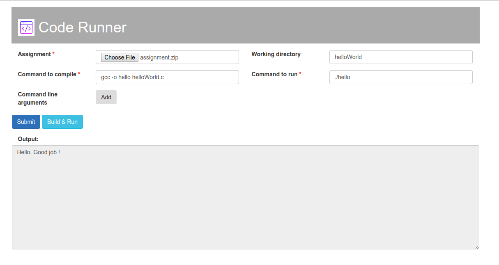

Code Runner: A tool to help run your assignments
===================================================
Code Runner is a web application to run code pertaining to your assignment using user provided configurations.

## Features
There are two roles in the application - Professor and Student.
#### Professor
- Professor provides course specific configurations for creating suitable docker environment.
- Course specific configurations include specifying operating system and its version, programming language and compiler.
#### Student
- Students can submit their assignments and view the output through a web page.
- They can also enter the optional command line arguments that are required to run their assignment.
- Web page accepts assignment files in compressed format. Allowed formats are .zip, .tar and .tar.gz.
      
Currently the application supports only server features:  
- Run the server
- Accept assignment files and command line argument
- Extract the files send status response to web page.

## Build and Run Server
Compile the source code using the `make` tool as shown below.
```commandline
make
```
Use the `-h` option to get information about other command-line options.

#### Port number
Use the `-port` option to specify the port number for the server to listen requests on. Below is an example.
```commandline
./code-runner-server -port <port>
```

## Send code files and arguments to server
Use curl command to connect to the server and send request.
Use multipart/form data option(-F) to provide the assignment submission file and the command-line arguments that are to be used when executing the code.
```commandline
curl <server_ip_address:port_number> -F <compressed_filepath> -F <arg1> -F <arg2> ...
```

## Web page to Submit Assignment


Submit your assignment through the web page as shown in the figure above.
- Choose the assignment tar ball.
- Enter commands to compile and run the code.
- Enter working directory to run the commands. If not provided then commands will be run at the root assignment directory.
- Add command line arguments if required to run the assignment using `Add` button.
- Click on `Submit` button to upload the details to the server.
- The status of upload will be displayed in the `Output` section.
- Click on `Build & Run` button to run the code.
- The output will be displayed in the `Output` section as shown above.
